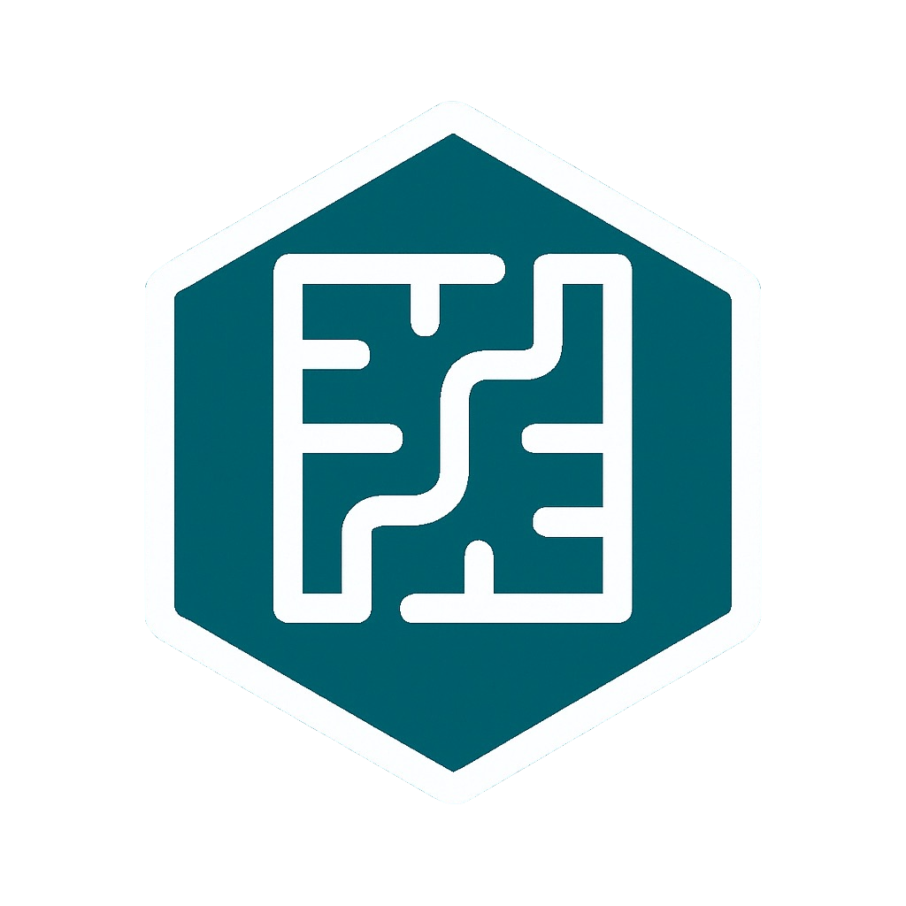

# 👩‍💻 AlgorithmAcademy

  
   

Welcome to **AlgorithmAcademy**!  
We are a collaborative, open-source organization focused on building educational tools, resources, and repositories to help developers prepare for coding interviews, master algorithms, and explore advanced computer science topics.

## 🎯 Mission

Our goal is to create high-quality, accessible resources for students, self-learners, and professionals aiming to strengthen their problem-solving and programming skills.

## 🙌 Get Involved

We welcome contributions from everyone — whether you're a beginner or a seasoned developer.

### 💡 Ways to contribute:
- Add new algorithms or improve existing ones
- Write documentation
- Create or review pull requests
- Help manage issues or maintain repositories

Start by checking out our [CONTRIBUTING.md](./CONTRIBUTING.md) guide.

## 💬 Questions or Ideas?

Open an issue or reach out — we’d love to hear from you!
